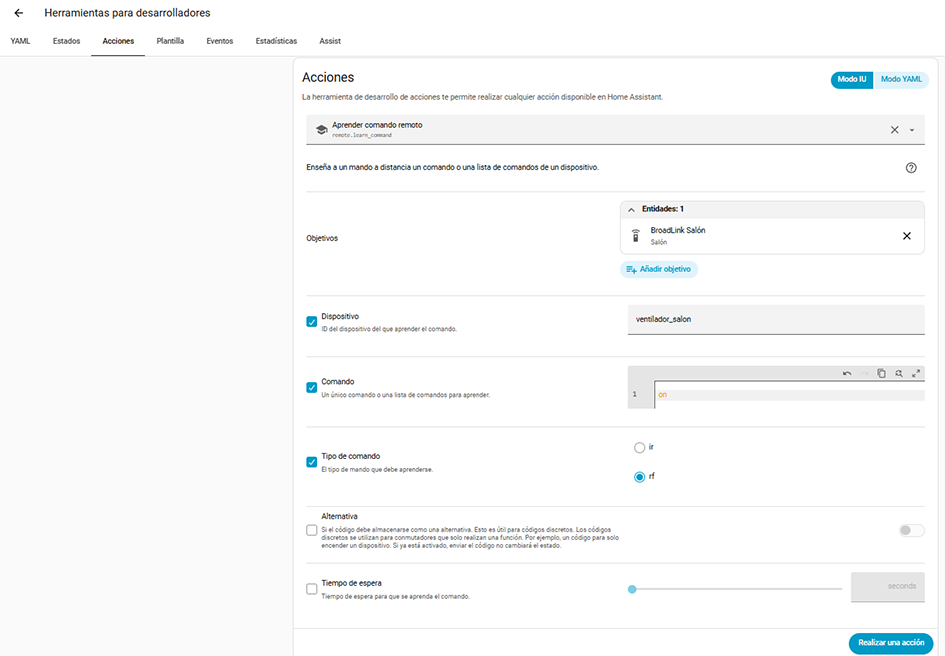
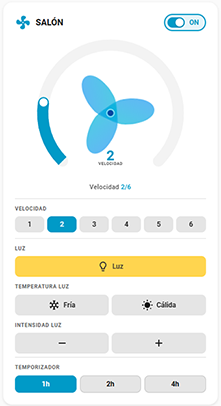
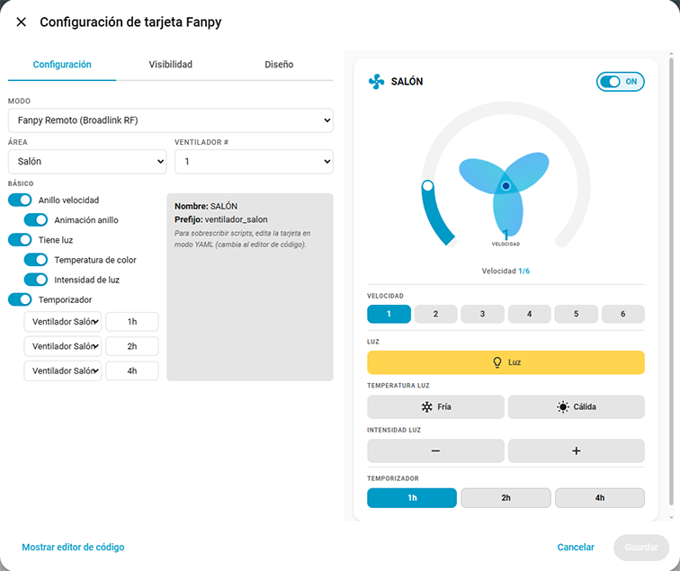
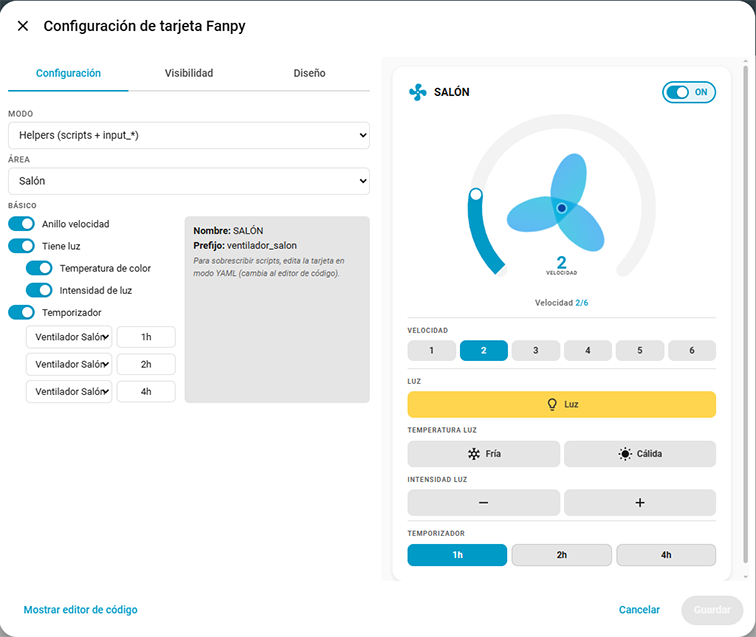

# Fanpy


[](https://opensource.org/licenses/Apache-2.0)

[](https://github.com/hacs/integration)
[](https://github.com/figorr/fanpy/actions/workflows/release.yml)


Custom integration for Home Assistant to configure ceiling fans for use with the [Fanpy Card](https://github.com/figorr/fanpy-card) Lovelace card.

## Purpose

Fanpy is the **backend companion** for the Fanpy Card. While the card provides the frontend UI, this integration provides the configuration wizard and generates all the necessary entities and scripts.

## Features

- ✅ **Multi-step setup wizard** — area selection, mode choice, light/features toggles, Broadlink configuration
- ✅ **Two integration modes**: Remote (Broadlink RF scripts) and Direct (native `switch.*` / `light.*` entities)
- ✅ **Automatic entity creation**: `switch.*` (power, light), `select.*` (speed), `binary_sensor.*` (state for card)
- ✅ **YAML generation** — generates `scripts.yaml` (RF commands) ready to `!include`
- ✅ **Timer support** — configurable number of timer buttons (0–3), exposed via a `select.fanpy_<prefix>_num_timers` entity that the card reads at runtime. Timer entities are created manually with the native HA timer helper; the card calls `timer.start`/`timer.cancel` natively.
- ✅ **Multi-language support**: English, Spanish, Catalan
- ✅ **HACS compatible**

### Integration Modes vs Card Modes

| Mode | Description | Integration | Card entity selection | Card service calls |
|------|-------------|-------------|----------------------|-------------------|
| **Fanpy Remote** | Fanpy entities (`switch.fanpy_*`, `select.fanpy_*`) + Broadlink RF scripts | Creates all entities + scripts | Auto by prefix (`fanpy_ventilador_{area}_*`) | Calls `script.{prefix}_*` for power/light/speed |
| **Fanpy Direct** | Fanpy speed select (`select.fanpy_*_velocidad`) + user's own `switch.*` / `light.*` (Shelly) | Creates only `select.fanpy_*_velocidad` and `binary_sensor.fanpy_*` | Manual (`entity_fan`, `entity_light`) | Calls `switch.turn_on/off`, `light.turn_on/off` directly; speed via `script.{prefix}_*` |

The card also supports two manual modes (Helpers and Direct) that don't require the Fanpy integration — see the [card documentation](https://github.com/figorr/fanpy-card) for details.

## Installation

### HACS (Recommended) — Not available yet

1. Open HACS.
2. Search for **Fanpy** and install it.
3. Restart Home Assistant.

### HACS (Repository method)

Install using HACS before the integration is added to the default HACS repository.

1. Open HACS within Home Assistant.
2. Select the 3-dot button (top right) and then **Custom repositories**.
3. In the dialog that appears, enter:
   - **Repository**: Add the URL to the [repository](https://github.com/figorr/fanpy) 
   - **Category**: Integration
4. Click **Add**.
5. Go to the **Search** tab of HACS and search for **Fanpy**.
6. Install it and restart Home Assistant.

### Manual

1. Download the `fanpy.zip` from the latest release.
2. Unzip and copy `custom_components/fanpy/` to your Home Assistant `custom_components` directory:
   ```
   /config/custom_components/fanpy/
   ```
3. Restart Home Assistant.

## Usage

1. After restart, go to **Settings > Devices & Services > Add Integration**.
2. Search for **Fanpy** and select it.
3. Follow the wizard steps:

### Fanpy Remote (Broadlink RF)

- **Step 1 — Mode**: Select **Remote**
- **Step 2 — Area**: Select the area where the fan is located and choose the fan number. If you select 1, the prefix will be `ventilador_{area}`; if 2 or higher, the prefix becomes `ventilador_{area}_{N}` so each fan gets unique entity IDs.
- **Step 3 — Speeds**: Set the number of speeds (1–10)
- **Step 4 — Light**: Toggle whether the fan has a light
- **Step 5 — Light Features** (if has light): Toggle color temperature and brightness controls
- **Step 6 — Timer**: Select the number of timers (0–3). The card will show that many timer buttons and call native `timer.start`/`timer.cancel` on the timer entities you create manually with the HA timer helper.
- **Step 7 — Broadlink & Commands**: Select the Broadlink `remote.*` entity, set the remote device name, and configure all RF commands (power, light, temperature, intensity, speed levels)

This mode creates `switch.fanpy_*`, `select.fanpy_*`, `binary_sensor.fanpy_*` plus all RF scripts. Use the card in **Fanpy Remote** mode.

### Fanpy Direct (Shelly switch.* / light.*)

- **Step 1 — Mode**: Select **Direct**
- **Step 2 — Area**: Select the area where the fan is located and choose the fan number
- **Step 3 — Fan & Speeds**: Select the existing `switch.*` entity (e.g. your Shelly relay) and set the number of speeds
- **Step 4 — Light**: Toggle whether the fan has a light
- **Step 5 — Light Entity** (if has light): Select the existing `light.*` entity
- **Step 6 — Light Features** (if has light): Toggle color temperature and brightness controls
- **Step 7 — Timer**: Select the number of timers (0–3). The card will show that many timer buttons and call native `timer.start`/`timer.cancel` on the timer entities you create manually with the HA timer helper.

This mode creates only `select.fanpy_*_velocidad` and `binary_sensor.fanpy_*`. The card reads your Shelly entities directly. Use the card in **Fanpy Direct** mode.

### Card Configuration

After creating entities with the integration, add the card to your Lovelace dashboard:

```yaml
type: custom:fanpy-card
mode: fanpy_remote        # or fanpy_direct
prefix: ventilador_bodega  # auto-generated by the integration
name: BODEGA               # auto-generated by the integration
has_light: true
```

For **Fanpy Direct**, you must also specify the entity IDs:

```yaml
type: custom:fanpy-card
mode: fanpy_direct
name: BODEGA
entity_fan: switch.shelly_relay_0
entity_light: light.shelly_rgb_1
has_light: true
```

### Generated Files

After setup, the integration generates a YAML file inside:
```
custom_components/fanpy/generated/
```

This file must be included in your HA configuration to activate the scripts.

### Option A: `!include` (Recommended)

Add this line to your `configuration.yaml`:

```yaml
script: !include custom_components/fanpy/generated/scripts.yaml
```

Then restart HA or call `script.reload`. The file updates automatically when you add/remove fans — no manual copying needed.

### Option B: Manual copy

If you prefer to manage scripts yourself:

1. Open `custom_components/fanpy/generated/scripts.yaml` and copy its content into your own `scripts.yaml`.
2. Make sure your `configuration.yaml` references it:
   ```yaml
   script: !include scripts.yaml
   ```
3. Restart HA or call `script.reload`.

> **Note:** With manual copy you must repeat the copy every time you change the fan configuration.

### About the generated scripts

For **Remote mode**, each script sends an RF command via Broadlink and updates the Fanpy entities so the card reflects the correct state:

```yaml
ventilador_salon_power_on:
  sequence:
  - action: remote.send_command
    metadata: {}
    data:
      num_repeats: 1
      delay_secs: 0.4
      hold_secs: 0
      device: ventilador_salon
      command: 'on'
    target:
      device_id: a1b2c3d4e5f6a7b8c9d0e1f2a3b4c5d6
  - action: switch.turn_on
    metadata: {}
    target:
      entity_id: switch.fanpy_ventilador_salon_power
    data: {}
  alias: "Ventilador Salón Power ON"
  description: ''
```

Speed scripts also update the speed selector and ensure power is on:

```yaml
ventilador_salon_velocidad_1:
  sequence:
  - action: remote.send_command
    metadata: {}
    data:
      num_repeats: 1
      delay_secs: 0.4
      hold_secs: 0
      device: ventilador_salon
      command: 'velocidad1'
    target:
      device_id: a1b2c3d4e5f6a7b8c9d0e1f2a3b4c5d6
  - action: select.select_option
    metadata: {}
    target:
      entity_id: select.fanpy_ventilador_salon_velocidad
    data:
      option: '1'
  - action: switch.turn_on
    metadata: {}
    target:
      entity_id: switch.fanpy_ventilador_salon_power
    data: {}
  alias: "Ventilador Salón Velocidad 1"
  description: ''
```

> The `device_id` is automatically resolved from the Broadlink remote entity you selected during setup. No manual configuration needed.

Make sure the command names match what you learned with `remote.learn_command`. You can test them with `remote.send_command`.

- **Broadlink learn command example:**

  

- **Broadlink send command test example:**

  

### Entity Naming

Each entity is created with:
- **Friendly name**: `Fanpy Ventilador {Area} Power` (you can edit the "Fanpy" prefix off later in Settings → Entities)
- **Entity ID**: `switch.fanpy_ventilador_{area}_power` — the `fanpy_` prefix lets the card find related entities automatically

## Reconfiguration

To change settings after initial setup:
1. Go to **Settings > Devices & Services**
2. Find the Fanpy integration entry
3. Remove and re-add it, selecting the new values

## Requirements

- Home Assistant 2025.12.5 or newer
- [Fanpy Card](https://github.com/figorr/fanpy-card) (for the Lovelace UI)
  - **The card**

    
  - **The editor**
  
    

    

## Development

```bash
git clone https://github.com/figorr/fanpy.git
cd fanpy
```

## Translations

To add a new language:

1. Create `custom_components/fanpy/translations/{lang}.json` with the same keys as `en.json`.
2. Submit a PR.

## License

Apache-2.0. See [LICENSE](LICENSE).
